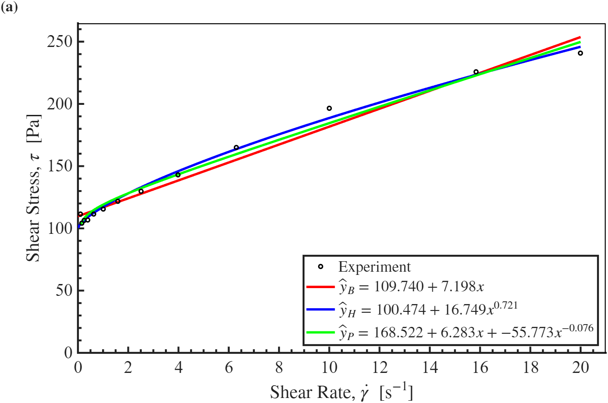

# MCEN3030 Homework 3

By Nikolas Mehan


## Problem 1

#### Function(s)

1. **```fit_linear(Z, y)```**

The purpose of the ```fit_linear``` function is to produce a predictive model that best fits the trend of a given dataset, while returning meaningful information comparing the model to the data.

#### Inputs (parameters)

1. ```Z, y```

* The script initializes a matrix ```Z``` using the form ```Z = [ones(size(x,1),1), x]```, which sets the value of the first column in each row to ```1``` determined by the length of the dataset. The second column is filled with the corresponding ```x``` value from the dataset.

$$
Z = \begin{bmatrix}
1 & x_1\\
1 & x_2\\
1 & x_3\\
\vdots & \vdots \\
1 & x_n
\end{bmatrix}.
$$

* The output of the dataset is given by the parameter, ```y```.

#### Returns

1. ```A, Y, E, R2```

* The coefficient vector ```A``` is the returned set of coefficients for the fitted model.
* The predicted (theoretical) model values are returned in the vector ```Y``` which is the same size as ```y``` (a.k.a. the data outputs).
* The residuals (errors) between the data ```y``` and predicted values ```Y``` are returned in the vector, ```E```.
* Finally, the coefficient of determination ```R2``` reflects how well the model fits the given dataset, where ```R2 = 1.0``` represents a perfect fit.

## Problem 2

*Note: the terms *parameter* and *coefficient* are used interchangeably.

A given dataset -- ```rheo_data.csv``` -- relates ```shear stress``` (```y```) to ```shear rate``` (```x```).

#### Function(s)

1. **```fit_nonlinear(x, y, model, seed)```**

The purpose of the ```fit_nonlinear``` function is to produce a predictive model that best fits the trend of the given dataset.

2. **```partial_function(model, x, A, i, y0)```**

The purpose of the ```partial_function``` function is to compute the partial derivative of the shear stress (```y```) with respect the the *i-th* model coefficient. The derivative is used to build the Jacobian matrix in the ```fit_nonlinear``` function required in updating the coefficient vector ```A```.

#### Inputs (parameters)

##### ```fit_nonlinear(x, y, model, seed)```

1. ```x, y, model, seed```

* The values of shear rate (inputs) from the dataset are given as a column vector, ```x```.
* The shear stress (outputs) from the dataset is given as the column vector, ```y```.
* The model function handle ```model``` defines the relationship between shear stress and shear rate. It is written as an anonymous function of the form ```model(x, A)```, where ```x``` is the shear rate vector (as previously mentioned) and ```A``` is the vector of unkown model coefficients. This method allows us to call the same ```fit_nonlinear``` function with *different* models (e.g. Hershel-Bulkley, Hershel-Bulkley-Plus).
* Our starting guess for our model coefficients is given as a column vector ```seed```. Its size is the number of parameters for the given model (*Note: each model has its own designated seed).

##### ```partial_function(model, x, A, i, y0)```

1. ```model, x, A, i, y0```

* The same model function handle ```model```.
* The same column vector ```x```.
* The *current* coefficient vector ```A```.
* The index of the parameter being differentiated ```i```.
* The *current* model prediction ```y0```. This variable is taken to avoid recomupting the predicted shear stress (```y```) for the current ```A``` vector (guess) within the ```partial_function```.

#### Returns

##### ```fit_nonlinear(x, y, model, seed)```

1. ```A```

* The coefficient vector ```A``` is the returned set of coefficients for the given model. The size of ```A``` depends on the size of the ```seed```, or, rather, the number of coefficients given by ```model```.

##### ```partial_function(model, x, A, i, y0)```

1. ```partial```

* The number ```partial```  that is returned after computing the partial derivative of the model output with respect to the *i-th* model coefficient.

## Plot of Non-Linear Fit Models and Data


